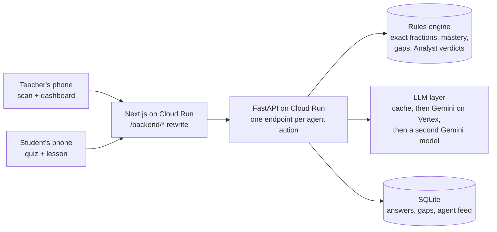

# GuruGraph

**Snap a photo of a student's notebook. GuruGraph circles the exact step that went wrong, names the misconception in plain words, plans tomorrow's first five minutes for the teacher, and gives the child a short lesson in Kannada, Hindi or English, plus two questions to close the gap.**

Built by Team X (T28) at ARGONYX '26, RV University, 25–26 Sep 2026. Everything in this repository was made during the 24-hour event (see [Built during the event](#built-during-the-event)).

[](https://github.com/Argonyx-26/T28-Team-X/actions/workflows/ci.yml)

- **Live API:** https://gurugraph-api-215071922486.asia-south1.run.app/docs
- **App:** https://gurugraph-web-215071922486.asia-south1.run.app
  - For judges (a 90-second tour and every number with its n and method): [/judges](https://gurugraph-web-215071922486.asia-south1.run.app/judges)
  - Teacher dashboard: [/teacher/7B](https://gurugraph-web-215071922486.asia-south1.run.app/teacher/7B)
  - Scan a notebook: [/teacher/7B/scan](https://gurugraph-web-215071922486.asia-south1.run.app/teacher/7B/scan)
  - Try it as Asha: [/join/7B?as=asha](https://gurugraph-web-215071922486.asia-south1.run.app/join/7B?as=asha)

---

## The problem
In NCERT's national PARAKH survey (2024, 21 lakh students), **Class 6 students got only 29% of fraction questions right**, their weakest maths skill. The mistakes are predictable: in a classic study, students added the tops and the bottoms separately (3/5 + 1/4 = 4/9) on a quarter of fraction-addition problems.

A teacher with 40 notebooks sees a red cross, not the reason. In a TISS survey of 3,615 Indian teachers, about one in four said they have too much correction work. Indian trials also show that **diagnosis alone doesn't raise learning**: diagnostic reports in Andhra Pradesh, and the CCE programme, made no difference because nothing changed in the next lesson. So GuruGraph doesn't stop at the diagnosis. Every diagnosis ends in a lesson, retry questions and a teacher plan.

Sources, each checked on its source page: [docs/research/EVIDENCE.md](docs/research/EVIDENCE.md).

## The loop (what the demo shows)
1. **The teacher scans Asha's notebook:** `3/4 + 1/4 = (3+1)/(4+4) = 4/8`. In about 5 seconds the steps come back transcribed, **step 2 is circled in red pen**, and the mistake is named: "added the denominators too".
2. **The class dashboard updates live:** a knowledge graph of 8 fraction concepts, a student-by-concept heatmap, and the agents' activity feed.
3. **The teacher presses Analyze.** The **Coach** drafts a plan from what a mark book shows. The **Analyst** checks it against every child's actual answers and vetoes it with numbers. The Coach revises, and the teacher approves.
4. **Asha gets a micro-lesson in Kannada** and two retry questions from a verified bank. Both right means **gap closed**, and the class meter moves.
5. **Her parent gets a WhatsApp message** in the family's language, with a voice note.
6. **The teacher has the last word:** one tap confirms or corrects any diagnosis, a whole pile of notebooks can be read at once, and each approved plan prints as a worksheet for that group.

## How it works



### AI does two jobs. Rules do the rest.
| Job | Who does it | Why |
|---|---|---|
| Reading handwriting (transcribing steps, finding the wrong line) | **Gemini 3 Flash** vision on Vertex AI | the only step that needs perception |
| Writing language (lessons, plans, parent messages, typed-answer feedback) | **Gemini 2.5 Flash** on Vertex AI (Nebius Token Factory plugs in as the first choice when a key is set) | fluent Kannada, Hindi and English |
| Right or wrong | **Rules**: exact `Fraction` arithmetic | a model must never mark a correct answer wrong |
| Which mistake an MCQ option or known wrong answer shows | **Rules**: the answer key and wrong-answer tables | deterministic, costs nothing |
| Mastery, the next question, when a gap opens or closes | **Rules** | explainable to a teacher |
| Whether a teaching plan fits the class | **Rules** (the Analyst) | the LLM may not overrule the numbers |

Even where the model reads a photo, the rules check it. If the final answer the model read has the exact value of the right answer, the work is marked right, whatever the model said (`source: vision+rule`).

### The agents
| Agent | Does | Engine |
|---|---|---|
| **Examiner** | picks each student's next question (the lowest-mastery concept whose prerequisites are ready) and grades retries exactly | rules |
| **Diagnostician** | names the misconception behind an answer or a photo of working | answer key → rules → LLM (typed) / vision (photos) |
| **Curator** | writes a ≤150-word micro-lesson in the student's language and picks 2 retry items from the verified bank | LLM + a language check (≥ 50% of letters in Kannada or Devanagari script, or it falls back to English and says so) |
| **Coach** | drafts and revises tomorrow's 5-minute plan | LLM |
| **Analyst** | aggregates the class and **audits every plan with binding rules** | rules |
| **Simulator** | a seeded class of 30 students answering through the same rules, so the dashboard has a realistic class | rules, zero LLM calls |

### Why the agents argue
The Coach sees what a mark book shows: averages and open gaps per concept. The Analyst sees which child made which mistake. Here is a real run on class 7B:

> **Coach (draft):** two plans. First, for the whole class: fix "adding without making the denominators the same". Second, for a re-teach group of 13: "Stop adding the denominators too".
> **Analyst:** *Plan 1: No student shows 'added without making the denominators the same' on Adding and subtracting fractions; target a mistake the class actually makes.* Plan 2 accepted: *13 of 31 students show 'added the denominators too'.*
> **Coach (revised):** two re-teach plans for the same 13 students.
> **Analyst:** *Plan 2 repeats plan 1 for the same students; give the other 18 students practice instead.*
> **Coach (revised again):** Group A (13) re-learns adding with the same denominator; Group B practises.
> **Analyst:** accepts both. The teacher approves.

The Analyst also vetoes whole-class plans when fewer than half the class shows the mistake ("re-teaching everyone wastes the period"). It sends back duplicate plans, plans longer than 5 steps and plans without a worked example. A plan that still fails after 2 rounds is flagged to the teacher, never hidden.

### Every AI call is measured
Every agent response carries telemetry (`provider · model · ms · tokens · ₹`), and the teacher's feed shows it. Successful calls are cached, and `DEMO_MODE=cached` replays the whole demo with no network.

## Evaluation
Every number carries *n* and the method. The raw rows are in [data/evals/results.json](data/evals/results.json).

| What | Result | Method |
|---|---|---|
| Question bank verified | 37 of 37 | every answer and every distractor is checked by exact fraction arithmetic in the test suite (part of the backend test suite) |
| Mistake named from a typed answer alone (the LLM fallback) | **27/30** | new problems, answered by applying a known wrong procedure (the label comes from how the answer was built); final answer only, no working |
| AI cost per student per month | **₹3.64** | measured calls (3 per action) × published per-token prices, for one photo diagnosis, lesson, parent message and Kannada voice note per student per week plus a shared class plan; the voice note is ₹2.56 of it ([unit_costs.json](data/evals/unit_costs.json)) |
| Handwritten work: wrong step circled, mistake named | *running on the 24 card photos* | 12 cards by 3 writers, labelled before running the model ([labels](data/evidence/labels.csv)) |

What we don't claim: we ran no classroom trial, have no users and no learning-gain data. The 30 students in class 7B are simulated, and Asha is a demo student.

## Sponsor technology
- **Nebius Token Factory:** built in as an OpenAI-compatible provider for the text agents, with token usage and ₹ cost shown per call. When `NEBIUS_API_KEY` is set it goes first and Gemini becomes the fallback. The demo currently runs on Gemini.
- **Raah:** browser-side analytics, wired into the app in `frontend/lib/raah.ts` and `frontend/components/site/raah.tsx`: the beacon in the root layout (per-endpoint latency of each agent, since there is one endpoint per agent action), custom events (`joined`, `diagnosed`, `photo_diagnosed`, `lesson_viewed`, `gap_closed`, `plan_approved`) and the public badge in the footer. It switches on when `NEXT_PUBLIC_RAAH_PID` is set at build time.

## Run it locally
```bash
cd backend && python -m venv .venv && .venv/Scripts/pip install -r requirements-dev.txt   # macOS/Linux: .venv/bin/pip
cp .env.example .env    # add NEBIUS_API_KEY and GCP_PROJECT (Vertex uses your gcloud login), or set DEMO_MODE=cached
.venv/Scripts/python -m uvicorn app.main:app --port 8010    # then open http://localhost:8010/docs
```
Class 7B (30 simulated students plus Asha) seeds itself on first start. Tests run offline: `pytest -q`.

## Runbook
| Task | Command (from `backend/`) |
|---|---|
| Reset the demo class (fresh Asha) | `curl -X POST $API/admin/reset -H "X-Admin-Token: …" -H 'content-type: application/json' -d '{}'` |
| Smoke-test the demo path on a live API | `python -m app.tools smoke $API` |
| Pre-generate lessons for review | `python -m app.tools warm-lessons && python -m app.tools lessons-review` |
| Run the evaluations | `python -m app.evals typed` · `python -m app.evals photos` |
| Deploy the API | `gcloud run deploy gurugraph-api --source . --region asia-south1` (from the repo root) |

## Privacy
- **Photos are never stored.** The server reads the image in memory, keeps only the diagnosis, and discards the photo.
- **Students join with a nickname.** GuruGraph never reads names off a sheet.
- Teacher pages have no login in this demo build; adding one is the first step of a real deployment.

## Built during the event
- **The code, the question bank, the prompts and the docs were all made here**, between 11:00 on 25 Sep and 11:00 on 26 Sep. The commit history is the record. The idea was the one selected in Round 1.
- **The team:** Samartha Puthraya K (agents and API), Rishabh Arun (UI), Risheeth S (research, evidence, pitch).
- **AI coding assistants:** we used Claude Code, Google Antigravity and Gemini, and every change was reviewed and tested by us.
