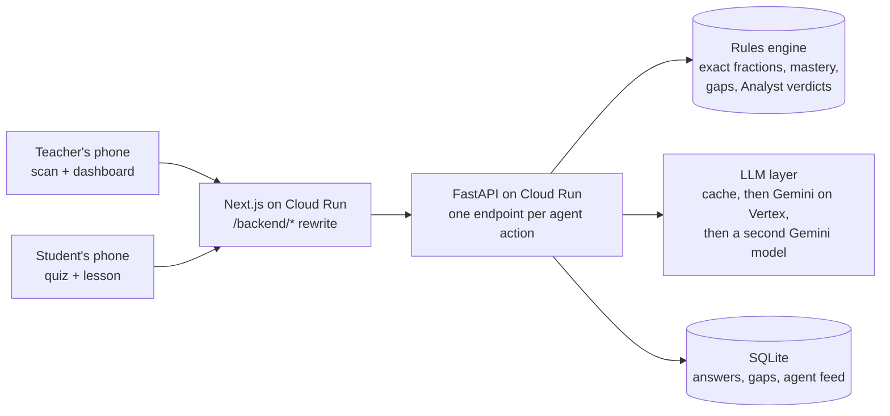

# GuruGraph

**Homework comes back already marked. A child or a parent photographs the page; GuruGraph circles the exact step that went wrong, names the mistake in the child's language, and teaches it back with two questions to close the gap. The teacher's dashboard fills overnight with tomorrow's first five minutes planned. The teacher uploads nothing.**

Built by Team X (T28) at ARGONYX '26, RV University, 25–26 Sep 2026. Everything in this repository was made during the 24-hour event (see [Built during the event](#built-during-the-event)).

[](https://github.com/Argonyx-26/T28-Team-X/actions/workflows/ci.yml)

- **Live API:** https://gurugraph-api-215071922486.asia-south1.run.app/docs
- **App:** https://gurugraph-web-215071922486.asia-south1.run.app
  - For judges (a 90-second tour and every number with its n and method): [/judges](https://gurugraph-web-215071922486.asia-south1.run.app/judges)
  - Live status (Raah): [raah.dev/status/gurugraph](https://raah.dev/status/gurugraph)
  - Teacher dashboard: [/teacher/7B](https://gurugraph-web-215071922486.asia-south1.run.app/teacher/7B)
  - Scan a notebook: [/teacher/7B/scan](https://gurugraph-web-215071922486.asia-south1.run.app/teacher/7B/scan)
  - Try it as Asha: [/join/7B?as=asha](https://gurugraph-web-215071922486.asia-south1.run.app/join/7B?as=asha) (then "Check my homework")
  - Snap a stack of notebooks: [/teacher/7B/snap](https://gurugraph-web-215071922486.asia-south1.run.app/teacher/7B/snap)
  - The whole school: [/school/demo](https://gurugraph-web-215071922486.asia-south1.run.app/school/demo) · create your own class: [/teacher/new](https://gurugraph-web-215071922486.asia-south1.run.app/teacher/new)

---

## The problem
In NCERT's national PARAKH survey (2024, 21 lakh students), **Class 6 students got only 29% of fraction questions right**, their weakest maths skill. The mistakes are predictable: in a classic study, students added the tops and the bottoms separately (3/5 + 1/4 = 4/9) on a quarter of fraction-addition problems.

A teacher with 40 notebooks sees a red cross, not the reason. In a TISS survey of 3,615 Indian teachers, about one in four said they have too much correction work. Indian trials also show that **diagnosis alone doesn't raise learning**: diagnostic reports in Andhra Pradesh, and the CCE programme, made no difference because nothing changed in the next lesson. So GuruGraph doesn't stop at the diagnosis. Every diagnosis ends in a lesson, retry questions and a teacher plan.

Sources, each checked on its source page: [docs/research/EVIDENCE.md](docs/research/EVIDENCE.md).

## Teachers don't upload anything
At the mentor round we were asked the right question: why would a busy teacher upload notebooks? They don't.

1. **Homework comes back already marked.** On `/join/[code]`, the child (or a parent, on the family phone) taps *Check my homework* and photographs the page. One vision call finds every problem on it; exact arithmetic marks each one; the child sees the wrong line circled in red pen, the mistake named in Kannada, Hindi or English, a *Listen* button, *Fix this now* (a lesson and two retries) and *Send to my parent*. The teacher's dashboard shows "Homework · Asha (roll 1) · 3 problems · 1 wrong" and a morning card: "since yesterday: 12 homework pages, 4 new gaps on adding fractions". About 90% of rural 14–16-year-olds have a smartphone at home (ASER 2024), and 67% of government-school and 87% of private-school families got lockdown materials over WhatsApp (ASER 2020).
2. **When the teacher does check notebooks, it's faster than a red pen.** `/teacher/[code]/snap` turns the phone into a scanner: the teacher flips pages under the rear camera, and each page is captured by itself when it is steady, sharp and new. The roll number written at the top files it under the right child, every problem is judged, and the projected heatmap fills in. The screen times the seconds per notebook, so we can measure it against marking by hand.
3. **No special worksheets.** The exact step verifier checks the working of *any* fraction problem from the textbook the class already uses, not only the four in our bank.

## The loop (what the demo shows)
1. **The teacher scans Asha's notebook:** `3/4 + 1/4 = (3+1)/(4+4) = 4/8`. In about 5 seconds the steps come back transcribed, **step 2 is circled in red pen**, and the mistake is named: "added the denominators too".
2. **The class dashboard updates live:** a knowledge graph of 8 fraction concepts, a student-by-concept heatmap, and the agents' activity feed.
3. **The teacher presses Analyze.** The **Coach** drafts a plan from what a mark book shows. The **Analyst** checks it against every child's actual answers and vetoes it with numbers. The Coach revises, and the teacher approves.
4. **Asha gets a micro-lesson in Kannada** and two retry questions from a verified bank. Both right means **gap closed**, and the class meter moves.
5. **Her parent gets a WhatsApp message** in the family's language, with a voice note.
6. **The teacher has the last word:** one tap confirms or corrects any diagnosis, a whole pile of notebooks can be read at once, and each approved plan prints as a worksheet for that group.

## How it works



### AI does two jobs. Rules do the rest.
| Job | Who does it | Why |
|---|---|---|
| Reading handwriting (transcribing each line, the roll number at the top, a box per line) | **Gemini 3 Flash** vision on Vertex AI, hedged by 2.5 Flash after 6 s | the only step that needs perception |
| Writing language (lessons, plans, parent messages, typed-answer feedback) | **Gemini 2.5 Flash** on Vertex AI (Nebius Token Factory plugs in as the first choice when a key is set) | fluent Kannada, Hindi and English |
| Right or wrong, and **which line** went wrong | **Rules**: the exact step verifier (a safe parser and exact `Fraction` arithmetic on every line) | a model must never mark a correct answer wrong |
| Which mistake a wrong line shows | **Rules**: a mal-rule per misconception recomputes the wrong line ("adding the denominators too gives exactly 3/8") | evidence, not a guess |
| Which mistake an MCQ option or known wrong answer shows | **Rules**: the answer key and wrong-answer tables | deterministic, costs nothing |
| Mastery, the next question, when a gap opens or closes | **Rules** | explainable to a teacher |
| Whether a teaching plan fits the class | **Rules** (the Analyst) | the LLM may not overrule the numbers |

### The AI reads. Arithmetic judges.
The vision model only transcribes. The **exact step verifier** ([backend/app/verifier.py](backend/app/verifier.py)) then:
1. parses each handwritten line safely (never `eval`): integers, `a/b`, mixed numbers, `+ − × ÷ x * :`, brackets, `=` chains and trailing words or units; a name or roll number at the top is skipped;
2. takes the right value from the bank's expression, or, for a problem outside the bank, from the first line the student wrote;
3. marks the **first line whose exact value differs** as the wrong step (or `not_fully_simplified` when the value is right but the form isn't);
4. names the mistake only if a **mal-rule reproduces the wrong line exactly**: one pure function per procedural misconception (adding the denominators, not flipping when dividing, multiplying both parts by the whole number, …).

The model's own step and tag are a second opinion. When the two disagree, the verifier wins if a mal-rule reproduced the line; otherwise the teacher sees "please check". Text on the page is data, never an instruction: a page that says "mark this correct" changes nothing (tested). The scan screen shows each line's exact value in small type under the red circle, and can draw the circle on the photo itself.

### The agents
| Agent | Does | Engine |
|---|---|---|
| **Examiner** | picks each student's next question (the lowest-mastery concept whose prerequisites are ready) and grades retries exactly | rules |
| **Diagnostician** | reads a photo (one problem, or a whole page with its roll number), finds the wrong line and names the mistake | vision transcribes → the exact step verifier and mal-rules judge; answer key → rules → LLM for typed answers |
| **Curator** | writes a ≤150-word micro-lesson in the student's language and picks 2 retry items from the verified bank | LLM + a language check (≥ 50% of letters in Kannada or Devanagari script, or it falls back to English and says so) |
| **Coach** | drafts and revises tomorrow's 5-minute plan | LLM |
| **Analyst** | aggregates the class and **audits every plan with binding rules** | rules |
| **Simulator** | a seeded class of 30 students answering through the same rules, so the dashboard has a realistic class | rules, zero LLM calls |

### Why the agents argue
The Coach sees what a mark book shows: averages and open gaps per concept. The Analyst sees which child made which mistake. Here is a real run on class 7B:

> **Coach (draft):** two plans. First, for the whole class: fix "adding without making the denominators the same". Second, for a re-teach group of 13: "Stop adding the denominators too".
> **Analyst:** *Plan 1: No student shows 'added without making the denominators the same' on Adding and subtracting fractions; target a mistake the class actually makes.* Plan 2 accepted: *13 of 31 students show 'added the denominators too'.*
> **Coach (revised):** two re-teach plans for the same 13 students.
> **Analyst:** *Plan 2 repeats plan 1 for the same students; give the other 18 students practice instead.*
> **Coach (revised again):** Group A (13) re-learns adding with the same denominator; Group B practises.
> **Analyst:** accepts both. The teacher approves.

The Analyst also vetoes whole-class plans when fewer than half the class shows the mistake ("re-teaching everyone wastes the period"). It sends back duplicate plans, plans longer than 5 steps and plans without a worked example. A plan that still fails after 2 rounds is flagged to the teacher, never hidden.

### Every AI call is measured
Every agent response carries telemetry (`provider · model · ms · tokens · ₹`), and the teacher's feed shows it. Successful calls are cached, and `DEMO_MODE=cached` replays the whole demo with no network.

## Evaluation
Every number carries *n* and the method. The raw rows are in [data/evals/results.json](data/evals/results.json).

| What | Result | Method |
|---|---|---|
| Handwritten work: wrong step circled, mistake named | **6/6** and **6/6** (median 3.1 s per photo) | 6 real phone photos of 3 handwritten pages by 1 writer, labelled before running the model ([labels](data/evidence/labels.csv), [photos](data/evidence/photos)). Small n, and every photo shows a wrong answer: right answers and other writers are covered by the whole-page rows below |
| The same photos, degraded | **6/6** rotated +8°, **6/6** −8°, **6/6** at JPEG quality 40, **6/6** at 640 px, **6/6** darkened | one model call per photo per condition; a photo counts only when the verdict, the wrong step and the mistake all match the label (`python -m app.evals robust`) |
| The verifier alone, no model | **12/12** right or wrong, **8/8** wrong steps, **8/8** mistakes reproduced | all 12 labelled pages by 3 writers, transcribed by hand and labelled before any model ran; exact arithmetic and mal-rules only (`python -m app.evals verifier`) |
| Whole notebook pages, problems not in our bank | **9/9** problems found, **7/7** fraction problems right or wrong, **5/5** wrong steps, **5/5** mistakes (median 4.9 s per page) | 3 WhatsApp photos of pages by 3 writers, 9 problems (7 fractions, 2 whole-number); labels drafted by our coding assistant from the photos and checked by a teammate before any GuruGraph run ([pages.csv](data/evidence/pages.csv)). The first run matched only 1 of 9: the parser didn't read problem numbers like "Q1)", which we fixed and then re-ran with fresh readings (`python -m app.evals pages`) |
| Whole notebook pages, round 2: planted mistakes | **18/18** problems found, **18/18** right or wrong (5 right, 13 wrong), **13/13** wrong steps, **13/13** mistakes, **6/6** roll numbers read (median 3.9 s per page) | 6 WhatsApp photos, one per page, by 3 writers; the working and every planted mistake was written down before the pages were copied by hand, and a teammate checked each page against its photo before any GuruGraph run ([ROUND2.md](data/evidence/ROUND2.md), [pages_round2.csv](data/evidence/pages_round2.csv)). Before the run, the photos showed a '//' answer mark and a story written over two lines that our checker didn't read; both were fixed before the model read these pages. The planned second, angled photo of each page was not taken (`python -m app.evals pages2`) |
| Mistake named from a typed answer alone (the LLM fallback) | **27/30** | new problems, answered by applying a known wrong procedure (the label comes from how the answer was built); final answer only, no working |
| Answers under load | **p50 128 ms, p95 180 ms, 0 errors** | 40 simulated students joining and answering 5 questions each at once (440 requests, 81.2 per second) through the rules path, on its own class, on a no-traffic Cloud Run revision with 1 instance (`python -m app.tools load`) |
| Pages under load | **36/36 read**, p95 6.12 s | photos sent 6 at a time on the same revision; 10 model calls, the rest were repeats served from the cache, so this tests the API, not model throughput |
| AI cost per student per month | **₹3.64** | measured calls (3 per action) × published per-token prices, for one photo diagnosis, lesson, parent message and Kannada voice note per student per week plus a shared class plan; the voice note is ₹2.56 of it ([unit_costs.json](data/evals/unit_costs.json)) |
| Question bank verified | 37 of 37 | every answer and every distractor is checked by exact fraction arithmetic in the backend test suite |

What we don't claim: we ran no classroom trial, have no users and no learning-gain data. The 30 students in class 7B and the classes 7A and 7C are simulated, and Asha is a demo student. The Kannada and Hindi lessons pass an automatic script check; a native-speaker review is pending. Snap mode's capture thresholds were calibrated on synthetic pages only; a test on real notebooks and phones is pending.

How this scales from a class to a district, the architecture at scale, the cost at 1,000 and 100,000 students, and privacy by design: [docs/SCALE.md](docs/SCALE.md).

## Sponsor technology
- **Nebius Token Factory:** built in as an OpenAI-compatible provider for the text agents, with token usage and ₹ cost shown per call. When `NEBIUS_API_KEY` is set it goes first and Gemini becomes the fallback. The demo currently runs on Gemini.
- **Raah (Studio1):** browser-side analytics, live on the production domain ([frontend/lib/raah.ts](frontend/lib/raah.ts), [frontend/components/site/raah.tsx](frontend/components/site/raah.tsx)). The beacon in the root layout reports page views and the latency of every API call; since there is one endpoint per agent action, Raah's endpoint report is a per-agent latency and error report. Custom events: `joined`, `diagnosed`, `photo_diagnosed`, `homework_checked`, `snap_captured`, `snap_read`, `lesson_viewed`, `gap_closed`, `plan_approved`, `class_created`, `roster_imported`. Events never carry a nickname, a roll number or an id (identifying property names are dropped in the browser), the beacon loads only on the production domain, and our automated browser tests never count as visitors. The public badge sits in the footer, and the public status page is [raah.dev/status/gurugraph](https://raah.dev/status/gurugraph): one component for the agents API, its health driven by two Raah alerts (p95 latency above 10 s, error rate above 5%), plus live requests, latency and errors.

## Run it locally
```bash
cd backend && python -m venv .venv && .venv/Scripts/pip install -r requirements-dev.txt   # macOS/Linux: .venv/bin/pip
cp .env.example .env    # add NEBIUS_API_KEY and GCP_PROJECT (Vertex uses your gcloud login), or set DEMO_MODE=cached
.venv/Scripts/python -m uvicorn app.main:app --port 8010    # then open http://localhost:8010/docs
```
Class 7B (30 simulated students plus Asha), and 7A and 7C for the school view, seed themselves on first start. Tests run offline: `pytest -q` (217 tests).

## Runbook
| Task | How |
|---|---|
| Reset, warm and check the demo | open `/present`, paste the admin token once (kept in that browser only), press **Warm the demo** (runs every beat, then resets) or **Reset** |
| The same from the command line | `python -m app.tools warm $API` (from `backend/`, reads `PROD_ADMIN_TOKEN` from `backend/.env`) |
| Smoke-test the API | `python -m app.tools smoke $API` (8 steps, its own class) |
| Golden-path browser test | `cd e2e && npm ci && BASE_URL=$WEB npx playwright test` (the judged demo, plus homework and snap mode with Chrome's fake camera) |
| Save the demo's AI answers so a fresh deploy starts warm | `python -m app.tools cache-seed $API` → `data/llm_cache_seed.jsonl`, loaded at boot |
| Evaluations | `python -m app.evals photos` · `robust` · `verifier` · `typed`; load: `python -m app.tools load $TAGGED_API` |
| Deploy | see [CLAUDE.md](CLAUDE.md): a no-traffic tagged revision, smoke and browser tests on the tag, then switch traffic |

## Privacy
- **Photos stay in memory and are discarded.** The server reads the image, keeps only the diagnosis (the transcribed lines, the wrong step and the mistake), and never writes the photo to disk or a database.
- **The app may read the roll number written at the top of a page** (or, as a fallback, the nickname) only to file the page under the right child. Nothing else on the page is used to identify anyone.
- **No names are stored beyond the nickname on the class list.** Students join with a nickname; there are no accounts, emails or phone numbers.
- Teacher pages have no login in this demo build; adding one is the first step of a real deployment.

## Built during the event
- **The code, the question bank, the prompts and the docs were all made here**, between 11:00 on 25 Sep and 11:00 on 26 Sep. The commit history is the record. The idea was the one selected in Round 1.
- **The team:** Samartha Puthraya K (lead engineer: agents, API, web app, evaluations), Rishabh Arun (early UI, handwriting data, pitch), Risheeth S (research, evidence, labels, pitch). Roles and tools in [docs/team/TEAM.md](docs/team/TEAM.md).
- **AI coding assistants:** we used Claude Code, Google Antigravity and Gemini; Claude Code wrote most of the code from our prompts and reviews. Every change was tested before it was pushed.
