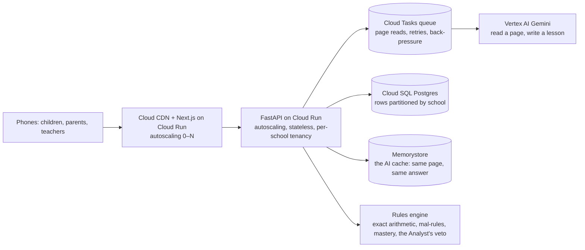

# GuruGraph at scale: from one class to a district

This document says what GuruGraph is **designed for** and what it has been **measured at**. It never claims a deployment
that hasn't happened. The measured numbers are in [data/evals/results.json](../data/evals/results.json) and
[data/evals/load.json](../data/evals/load.json), and they appear on `/judges` with their n and method.

## 1. The path: class → school → cluster → district

| Level | Unit | What GuruGraph adds | Who looks at it |
|---|---|---|---|
| **Class** (today) | 30–45 children, one teacher | the heatmap, the wrong step on every page, tomorrow's 5-minute plan, a lesson per child | the teacher, on a phone or a projector |
| **School** (built, seeded) | 5–30 classes | classes × concepts, the top misconceptions across the school, which class needs which re-teach (`/school/[id]`) | the head teacher, the maths coordinator |
| **Cluster** (designed) | 10–20 schools | the same grid across schools; which re-teach lesson to run in the cluster's teacher meeting | the cluster resource person |
| **District** (designed) | 500–2,000 schools | misconception prevalence per block, per medium of instruction; where the textbook example itself misleads | the district education officer, the SCERT |

The unit of data never changes: **one child, one problem, one wrong step, one named mistake.** Every level is an
aggregation of that row, and every aggregation is a rules-only query (no model call), so a district view costs
nothing to compute.

## 2. Architecture at scale (designed for)

Today (one class, one demo): two Cloud Run services (Next.js and FastAPI), SQLite inside the API container, Gemini on
Vertex AI for reading pages and writing language, exact fraction arithmetic for every decision.

Designed for a state deployment:

- **Stateless API, autoscaling.** The only state the API keeps in memory today (the rate limiter, the lesson jobs,
  voice clips) moves to Memorystore, so Cloud Run can run N instances. The database moves from SQLite to Cloud SQL
  (Postgres) with the same schema: `session`, `student`, `response`, `gap`, `agent_event`, `recommendation`,
  `llm_cache`, `review`. The SQL is already plain and portable.
- **A queue for page reads.** Homework arrives in bursts (7–9 pm). A page read is 2–8 s of model time, so reads go
  through Cloud Tasks with a concurrency cap per school and exponential retries; the child's phone polls for the
  result. The demo already reads 6 pages at a time with a semaphore; the queue is the same idea across instances.
- **Per-school tenancy.** Every table row carries a `session_id`; sessions belong to a school; a school's teacher key
  scopes every query. Cross-school views (cluster, district) read only aggregates.
- **The cache is the cost lever.** Identical pages (the same sample, a re-scan) and identical plan prompts are served
  from the cache; the UI marks them "cached". At scale the cache moves to Memorystore with a 30-day TTL.
- **Models are replaceable.** One `generate()` entry point with a route of providers (today: Gemini 3 Flash for
  vision, hedged by 2.5 Flash; 2.5 Flash for text, backed by 2.5 Flash-Lite). Nebius Token Factory plugs in as an
  OpenAI-compatible provider when a key is set.

## 3. Measured (so far)

| What | Value | How |
|---|---|---|
| Photo diagnosis time | see `/judges` ("Photo diagnosis time (median / p95)") | server-side model time per real photo in the evaluation |
| Wrong step and mistake from real phone photos | see `/judges` | 6 real photos of 3 pages, labelled before the run |
| Robustness (rotated, JPEG 40, 640 px, dark) | see `/judges`, one row per condition | the same photos, degraded, one model call each |
| Exact verifier on 12 labelled pages | see `/judges` ("by arithmetic alone") | no model call |
| Answers under load | see `/judges` ("Answers under load") | simulated students answering at once on a tagged revision |
| Pages read per minute under load | see `/judges` | photos read 6 at a time on a tagged revision |

Everything under load was run on **one** Cloud Run instance with one worker, on a no-traffic tagged revision, on its
own class. It is a floor, not a ceiling: the rules path is CPU-light SQLite reads and writes, and page reads are bound
by the model, not the API.

## 4. Cost per student (measured unit costs, projected usage)

Unit costs are measured from real calls ([data/evals/unit_costs.json](../data/evals/unit_costs.json)): one photo
diagnosis, one lesson, one parent message, one Kannada voice note, one class plan shared by 30. The per-month figure
assumes one of each per child per week. At scale the AI cost is the only cost that grows per child; hosting is
shared.

| Students | AI per student per month (measured unit costs × the same usage) | Hosting (designed) | Total per student per month |
|---|---|---|---|
| 1,000 (one school cluster) | ₹3.64 | 2 Cloud Run services, Cloud SQL smallest tier: about ₹6,000/month → ₹6.0 | about ₹9.6 |
| 100,000 (a district) | ₹3.64, less with the cache (identical lessons and plans are served from it) | autoscaled Cloud Run, Cloud SQL HA, Memorystore: about ₹1.5 lakh/month → ₹1.5 | about ₹5.1 |

The hosting figures are Google Cloud list prices for the components above, not a quote. The AI figure is measured.
The voice note is ₹2.56 of the ₹3.64; without it the AI cost is about ₹1.1 per child per month.

## 5. Privacy by design for children's data (DPDP Act 2023 in mind)

Designed for, and largely built:

- **Data minimisation.** A child is a nickname and a roll number on a class list. No phone numbers, emails or photos
  of faces are collected. Photos of pages stay in memory and are discarded after reading; only the transcribed
  lines, the wrong step and the mistake are kept.
- **Purpose limitation.** The roll number (or the nickname) written at the top of a page is read for one purpose: to
  file the page under the right child. Nothing else on the page identifies anyone.
- **Verifiable parental consent for children** (DPDP Act §9) is the school's and the parent's: the design is that a
  school enrols a class with parental consent it already holds, and a parent's WhatsApp number never enters the
  system (the parent message opens in the parent's own WhatsApp from the teacher's phone).
- **No tracking, no profiling for other purposes.** Analytics events never carry a nickname or an id.
- **Retention.** Designed for a school-year retention with deletion at the end of the year, and deletion on request
  through the school.
- **Access.** Teacher pages have no login in this demo build. Designed: a teacher key per class, a school admin, and
  audit logs (the agent feed already records every teacher review and approval).

We do not claim compliance with the DPDP Act or its rules; we claim a design that keeps the data small enough to comply.
